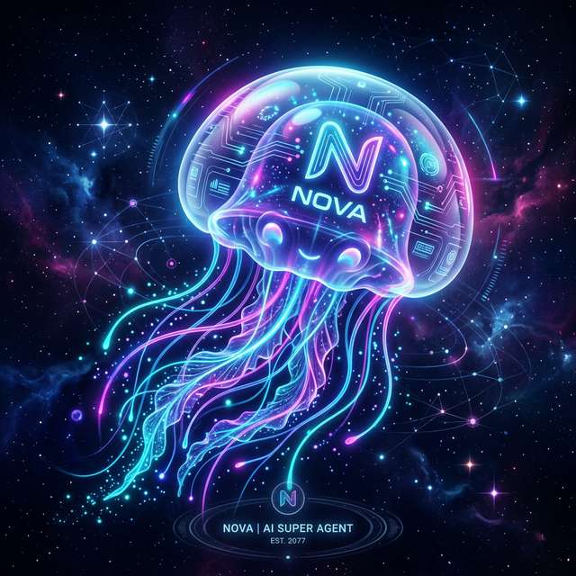
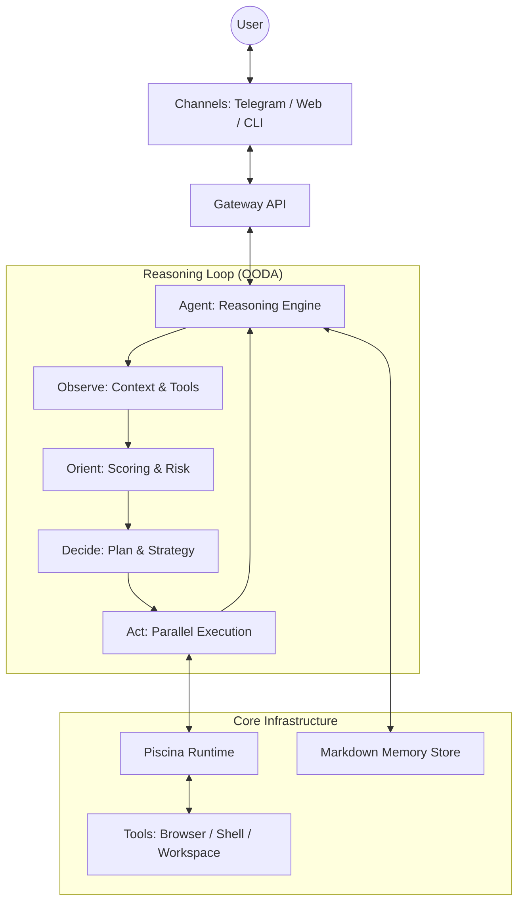

# <p align="center"></p>

# <p align="center">NOVA — EVOLVE. EXECUTE. EMPOWER. ⚡</p>

**Absolute Sovereign Autonomy. Multi-tool. Multi-channel. Local-first.**

[](https://www.npmjs.com/package/novaa-agent)
[](https://opensource.org/licenses/MIT)
[](https://www.typescriptlang.org/)

---

## 🧐 What is Nova?

Nova is a high-performance **reasoning engine** designed to live on your machine and act on your behalf. Built around a strict **OODA Loop** (Observe, Orient, Decide, Act), Nova doesn't just "complete text"—it plans, reasons, and executes multi-step workflows in isolated worker threads.

From mastering your inbox to browsing the web with visual analysis, Nova is the architectural backbone for the next generation of personal AI assistants. It gives you **God-Mode** over your local environment and digital life.

---

## 🚀 Quick Start

Get Nova up and running in seconds via npm:

```bash
# 1. Install globally
npm install -g novaa-agent

# 2. Start the engine
nova daemon start

# 3. Enter the loop
nova chat
```

---

## ⚖️ Why Nova?

| Feature          | Standard AI Bots     | Nova Framework 🚀                 |
| :--------------- | :------------------- | :-------------------------------- |
| **Logic**        | Sequential Prompting | **Continuous OODA Reasoning**     |
| **Memory**       | Transient Context    | **Local Markdown-first Memory**   |
| **Execution**    | Sequential Calls     | **Threaded Tool Parallelism**     |
| **Control**      | Cloud-lock-in        | **Local-first Sovereign Control** |
| **Intelligence** | Reactive             | **Proactive Heartbeat Engine**    |

---

## 🌌 Absolute Capabilities

Nova's power comes from its specialized skills, executed sequentially or in parallel depending on the complexity of your intent.

### 🌐 Web Intelligence & Autonomous Browsing

- **Execute Semantic Search**: Query multiple engines and rerank results based on relevance.
- **Perform Visual Analysis**: "See" the page using computer vision to understand layouts and find interactive elements.
- **Maintain Persistent Sessions**: Stay logged into your favorite platforms across multiple tasks.
- **Extract Structured Data**: Turn messy websites into clean JSON or Markdown reports automatically.

### 💼 Native Google Workspace Integration

- **Master Gmail**: Read threads, draft context-aware responses, and archive or organize your inbox.
- **Govern Calendar**: Check your availability, schedule complex meetings involving multiple parties, and give you morning briefings.
- **Navigate Drive**: Search through thousands of documents, read their contents, and generate new reports based on your data.

### 💻 Local System Sovereignty

- **Shell & Scripting**: Run bash, zsh, or python scripts to automate project builds or environment setups.
- **File System Mastery**: Read, write, move, and analyze files across your entire project structure.
- **System Awareness**: Monitor CPU usage, manage processes, and get detailed system telemetry.

### 🤖 Proactive Intelligence

- **Autonomous Task Execution**: Schedule and run recurring tasks like "Check my emails every hour and notify me of urgent ones."
- **Proactive Reminders**: Nudge you about upcoming events or deadlines in a natural, friendly way via Telegram.
- **Self-Updating Identity**: Nova learns about you, updating its own "User Profile" markdown file as it learns your preferences and goals.

---

## ✨ Key Features

- **🧠 OODA Reasoning Loop**: A real-time cycle that allows the agent to self-correct and adapt during complex tasks.
- **📖 Human-Readable Memory**: Memory is stored in plain-text Markdown. No black-box databases—you can audit and edit what your agent "knows" at any time.
- **⚡ Parallel Execution**: Tools run in isolated worker threads via Piscina. Nova can browse, read, and call APIs simultaneously.
- **🔒 Security-First**: Capability-based permission system with optional manual approval for high-risk actions.

---

## 📡 Supported Channels

- **Telegram**: Feature-rich mobile interface with live progress streaming, image support, and proactive notifications.
- **CLI**: Native terminal interface for developers who want raw control and local execution logs.
- **WebSocket**: High-performance API for building custom frontends or dashboard integrations.

---

## 🏗️ Architecture



---

## 📝 License

MIT License - see [LICENSE](LICENSE) for details.

---

**Nova — Absolute Sovereign Autonomy.** 🚀
