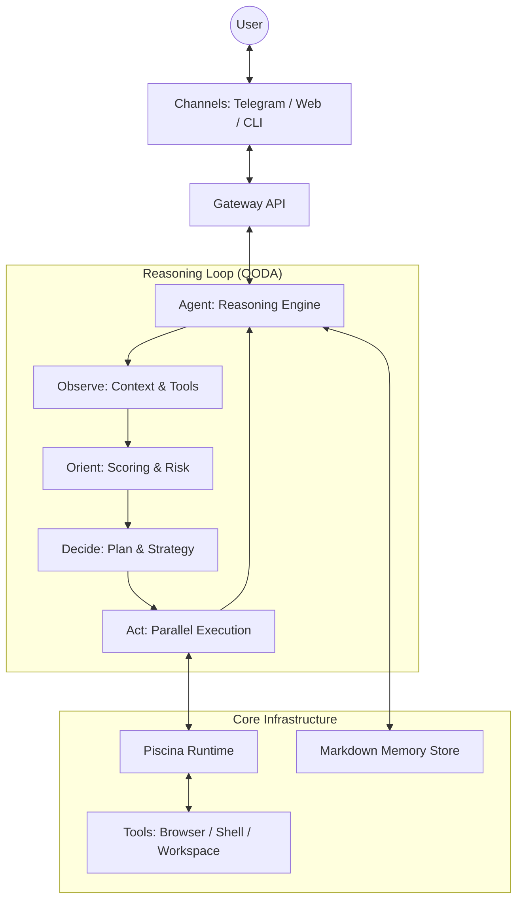

# NOVA — God-Mode for your Local Network ⚡

**Absolute Sovereign Autonomy. Multi-tool. Multi-channel. Local-first.**

---

## 🧐 What is Nova?

Nova is not just another GPT wrapper. It is a high-performance **reasoning engine** designed to live on your machine and act on your behalf. Built around a strict **OODA Loop** (Observe, Orient, Decide, Act), Nova doesn't just "complete text"—it plans, reasons, and executes multi-step workflows in isolated worker threads.

From managing your calendar and drafting emails to browsing the web with visual analysis, Nova is the architectural backbone for the next generation of personal AI assistants. It gives you **God-Mode** over your local environment and digital life.

---

## ⚖️ Why Nova?

| Feature          | Standard AI Bots     | Nova Framework 🚀                 |
| :--------------- | :------------------- | :-------------------------------- |
| **Logic**        | Sequential Prompting | **Continuous OODA Reasoning**     |
| **Memory**       | Transient Context    | **Local Markdown-first Memory**   |
| **Execution**    | Sequential Calls     | **Threaded Tool Parallelism**     |
| **Control**      | Cloud-lock-in        | **Local-first Sovereign Control** |
| **Intelligence** | Reactive             | **Proactive Heartbeat Engine**    |

---

## 🌌 Absolute Capabilities

Nova's power comes from its specialized skills, executed sequentially or in parallel depending on the complexity of your intent.

### 🌐 Web Intelligence & Autonomous Browsing

Nova can traverse the modern web better than a human. It uses **Playwright** to open real browser sessions, allowing it to:

- **Execute Semantic Search**: Query multiple engines and rerank results based on relevance.
- **Perform Visual Analysis**: "See" the page using computer vision to understand layouts and find interactive elements.
- **Maintain Persistent Sessions**: Stay logged into your favorite platforms across multiple tasks.
- **Extract Structured Data**: Turn messy websites into clean JSON or Markdown reports automatically.

### 💼 Native Google Workspace Integration

Nova lives inside your office suite. It has native specialized skills to:

- **Master Gmail**: Read threads, draft context-aware responses, and archive or organize your inbox.
- **Govern Calendar**: Check your availability, schedule complex meetings involving multiple parties, and give you morning briefings.
- **Navigate Drive**: Search through thousands of documents, read their contents, and generate new reports based on your data.

### 💻 Local System Sovereignty

Nova is the master of your machine. It can interact with your OS at the deepest level:

- **Shell & Scripting**: Run bash, zsh, or python scripts to automate project builds or environment setups.
- **File System Mastery**: Read, write, move, and analyze files across your entire project structure.
- **System Awareness**: Monitor CPU usage, manage processes, and get detailed system telemetry.
- **Visual Control**: Capture screenshots of your desktop and manage your clipboard for seamless data transfer.

### 🤖 Proactive Intelligence & Task Management

Nova doesn't wait for your orders. It uses its **Heartbeat Engine** to:

- **Autonomous Task Execution**: Schedule and run recurring tasks like "Check my emails every hour and notify me of urgent ones."
- **Proactive Reminders**: Nudge you about upcoming events or deadlines in a natural, friendly way via Telegram.
- **Self-Updating Identity**: Nova learns about you. It updates its own "User Profile" markdown file as it learns your preferences, project goals, and habits.

---

## ✨ Key Features

- **🧠 OODA Reasoning Loop**: A real-time _Observe, Orient, Decide, Act_ cycle that allows the agent to self-correct and adapt during complex tasks.
- **📖 Human-Readable Memory**: Memory is stored in plain-text Markdown. No black-box databases—you can audit and edit what your agent "knows" at any time.
- **⚡ Piscina Parallelism**: Tools run in isolated worker threads. Nova can browse the web, read files, and call APIs simultaneously.
- **🔒 Security-First**: Capability-based permission system with optional manual approval for high-risk actions (like shell execution).

---

## 📡 Supported Channels

- **Telegram**: A feature-rich mobile interface with live progress streaming, image support, and proactive notifications.
- **WebSocket**: High-performance API for building custom frontends or dashboard integrations.
- **CLI**: Native terminal interface for developers who want raw control and local execution logs.

---

## 🏗️ Architecture

---

## 🔧 Configuration

To take control of Nova, configure your environment and connect your channels.

### System Setup

1. **Clone the Backbone**: Download the repository to your local machine.
2. **Install & Build**: Run the standard installation commands to prepare the runtime.
3. **Configure Environment**: Set your API keys and channel tokens in a `.env` file.

### Channel Integration (Telegram)

1. Create a bot with [@BotFather](https://t.me/botfather) and get your token.
2. Link your token using the Nova CLI setup tool.
3. Start the daemon and message your bot to establish a secure link.

### Running Nova

- **Starting the Daemon**: Launch the background gateway to enable API and Telegram access.
- **Chatting**: Use the CLI or Telegram to begin interacting with your agent.

---

## 📝 License

MIT License - see [LICENSE](LICENSE) for details.

---

**Nova — Absolute Sovereign Autonomy.** 🚀
