# How Nova Works — Architecture Deep Dive

Nova is a personal AI agent that receives messages from users (via WebSocket or Telegram), reasons about what to do, executes tools when needed, stores everything in Markdown files, and responds with personality loaded from `soul.md`.

---

## High-Level Flow

```mermaid
graph TD
    A["User sends message"] --> B["Channel (WebSocket / Telegram)"]
    B --> C["ChatService.runChatTurn()"]
    C --> D["ResearchOrchestrator.runChatTurn()"]
    D --> E["OODA Loop (Observe → Orient → Decide)"]
    E --> F{"Needs tools?"}
    F -->|Yes| G["Agent.chatWithTools() → Tool execution loop"]
    F -->|No| H["Agent.chatWithTools() → Direct response"]
    G --> I["Store in MarkdownMemory"]
    H --> I
    I --> J["Response sent back to user"]
```



---

## 1. Entry Points — How Messages Arrive

Nova has two channels for receiving messages:

### WebSocket (`ws://127.0.0.1:18789`)

Used by `nova chat` CLI and any WebSocket client. The gateway in [gateway/src/index.ts](file:///Users/engmare/personal-projects/nova/gateway/src/index.ts) sets up a Fastify server with:

```
ws://127.0.0.1:18789/ws?sessionId=<id>
```

When a message arrives, it calls `chatService.runChatTurn()`.

### Telegram Bot

The [TelegramChannel](file:///Users/engmare/personal-projects/nova/gateway/src/channels/telegram.ts) polls the Telegram Bot API. When a message arrives from the authorized owner, it routes through `chatService.runChatTurn()` with `channel: "telegram"`.

**Both channels converge into the same pipeline:**

```
User Message → ChatService → ResearchOrchestrator → ReasoningEngine → Agent → LLM
```

---

## 2. ChatService — The Router

[chat-service.ts](file:///Users/engmare/personal-projects/nova/gateway/src/chat-service.ts) manages session histories and routes messages.

**What happens when a message arrives:**

1. **Get or create history** — looks up the session's conversation history (in-memory map). If new, seeds it with a system prompt built from `soul.md`.
2. **Route to orchestrator** — calls `ResearchOrchestrator.runChatTurn()`.
3. **Update history** — stores the updated history for the next turn.
4. **Shadow mode** (optional) — runs a parallel plain `agent.chat()` call for comparison logging.

### System Prompt Construction

If `soul.md` exists at `~/.nova/soul.md`, its content becomes the system prompt:

```
Current date and time: 2026-02-21T15:00:00.000Z.

# Nova — Personal AI Agent
## Personality
- Warm, curious, proactive...
## Response Style
- Natural paragraphs...
```

Without `soul.md`, falls back to: _"You are Nova, a personal AI assistant. Be warm, direct, and genuinely helpful."_

---

## 3. ResearchOrchestrator — The Brain

[research-orchestrator.ts](file:///Users/engmare/personal-projects/nova/gateway/src/research-orchestrator.ts) is where the magic happens. It runs the full OODA reasoning loop, then executes tools in a multi-iteration loop.

### Step-by-step flow:

#### Step 1: Store user message

```
convStore.addMessage({ role: "user", content: "what's the weather in Lagos?", ... })
```

Written to `~/.nova/memory/conversations/<session-id>.md`.

#### Step 2: Get memory context

```
knowledgeStore.getTopMemoryItems("owner", 3)
```

Retrieves the top-3 most important knowledge items from `~/.nova/memory/knowledge.md` to inject as context.

#### Step 3: Run OODA reasoning

The ReasoningEngine runs three LLM calls:

```
OBSERVE → ORIENT → DECIDE
```

Each produces a "thought" that feeds into the next phase (detailed in section 4).

#### Step 4: Tool execution loop (if needed)

If the LLM response contains tool calls, the orchestrator enters an iterative loop:

```
while (iterations < maxIterations) {
  response = agent.chatWithTools(history, tools)

  if (response has tool calls) {
    for each toolCall:
      result = runtime.executeTool(toolCall.name, toolCall.parameters)
      append tool result to history

    iterations++
    continue  // ask LLM again with tool results
  }

  break  // LLM gave a text response, we're done
}
```

**Important behaviors:**

- **Max 10 iterations** — prevents infinite tool loops
- **Forced synthesis** — if the loop hits the cap after tools ran, it forces a final synthesis call
- **Citation repair** — if web tools were used but no sources in the response, a repair call is made
- **Timeout per tool** — 45 seconds default

#### Step 5: Store assistant response

```
convStore.addMessage({ role: "assistant", content: responseText, ... })
```

---

## 4. OODA Loop — How Nova Thinks

The [OODA loop](file:///Users/engmare/personal-projects/nova/agent/src/reasoning/ooda-loop.ts) runs three LLM calls before any tool use. Each call produces a JSON thought.

### OBSERVE — "What do I see?"

**Prompt:** Analyze the user's message, tone, urgency, and any memory context.

**Output example:**

```json
{
  "observation": "User is asking about weather — a factual, real-time question",
  "userState": "Casual inquiry, not urgent",
  "knownContext": "User is based in Lagos (from memory)",
  "unknowns": ["Current weather conditions"],
  "confidence": 0.85
}
```

### ORIENT — "What should I do?"

**Prompt:** Assess intent, choose approach, decide if tools are needed. Also assesses delegation to sub-agents.

**Output example:**

```json
{
  "intent": "Get current weather for Lagos",
  "approach": "action-oriented — use web search then respond naturally",
  "needsTools": true,
  "toolHints": ["web_search"],
  "personalityNotes": "Be enthusiastic about sharing the weather",
  "shouldDelegate": false,
  "confidence": 0.9
}
```

### DECIDE — "How exactly should I respond?"

**Prompt:** Pick a concrete strategy, tone, and response type.

**Output example:**

```json
{
  "strategy": "Search for Lagos weather, format as a natural conversational update",
  "responseType": "informational",
  "curiosityTarget": "Ask if they're heading out today",
  "toneGuide": "warm and helpful",
  "confidence": 0.88
}
```

**All three thoughts are assembled into a single reasoning trace:**

```
[OBSERVE] (0.85) User is asking about weather...
[ORIENT] (0.90) Intent: Get current weather. Tools needed: web_search
[DECIDE] (0.88) Strategy: Search then respond naturally. Tone: warm
```

This trace is injected into the LLM's context so it "remembers" its own reasoning when generating the final response.

---

## 5. Tool System — What Nova Can Do

### Core Tools (always available)

| Tool    | What it does           |
| ------- | ---------------------- |
| `bash`  | Execute shell commands |
| `read`  | Read file contents     |
| `write` | Write file contents    |
| `curl`  | Make HTTP requests     |

### Web Browsing Skill (9 tools)

Loaded from [skills/core/web-browsing/tools.ts](file:///Users/engmare/personal-projects/nova/skills/core/web-browsing/tools.ts):

| Tool                     | What it does                                           |
| ------------------------ | ------------------------------------------------------ |
| `web_search`             | Search the web via Brave Search API                    |
| `browse`                 | Open URL in browser, take screenshot, analyze visually |
| `scrape`                 | Extract readable text from a URL                       |
| `web_session_start`      | Start persistent browser session                       |
| `web_observe`            | Capture browser state                                  |
| `web_decide_next`        | Decide next browser action                             |
| `web_act`                | Execute browser action (click, type, etc.)             |
| `web_extract_structured` | Extract structured data from page                      |
| `web_session_end`        | End browser session                                    |

### Google Workspace Skill (14 tools)

Loaded from [skills/core/google-workspace/tools.ts](file:///Users/engmare/personal-projects/nova/skills/core/google-workspace/tools.ts):

| Tool               | What it does            |
| ------------------ | ----------------------- |
| `gmail_list`       | List recent emails      |
| `gmail_read`       | Read a specific email   |
| `gmail_send`       | Send an email           |
| `gmail_reply`      | Reply to a thread       |
| `gmail_search`     | Search emails           |
| `gmail_draft`      | Create a draft          |
| `calendar_list`    | List upcoming events    |
| `calendar_create`  | Create a calendar event |
| `calendar_search`  | Search events           |
| `drive_list`       | List Drive files        |
| `drive_search`     | Search Drive files      |
| `drive_read`       | Read a Drive file       |
| `drive_upload`     | Upload to Drive         |
| `drive_create_pdf` | Create a PDF on Drive   |

### How tools are loaded

At gateway startup:

1. `ToolRegistry` registers core tools (bash, read, write, curl)
2. `wireSkillTools()` discovers SKILL.md manifests in `skills/core/*/` and loads their `tools.ts` arrays
3. `wireBrowseTools()` patches `execute()` handlers onto browse/scrape tools
4. `wireGoogleWorkspaceTools()` patches `execute()` handlers onto Gmail/Calendar/Drive tools

---

## 6. Memory — How Nova Remembers

All memory lives in `~/.nova/memory/` as human-readable Markdown and JSON files.

### File Layout

```
~/.nova/memory/
├── conversations/
│   ├── session-abc123.md    # Full conversation transcript
│   └── session-def456.md
├── user.md                  # User traits (name, timezone, preferences)
├── knowledge.md             # Learned facts with importance scores
├── relationships.md         # People and their connections
├── identity.md              # Agent's self-knowledge
├── learning-jobs.json       # Async learning job queue
└── approvals.json           # Pending approval requests
```

### Conversation Files

Each conversation creates a file like `~/.nova/memory/conversations/session-abc123.md`:

```markdown
# Conversation session-abc123

Channel: ws

---

**user** (2026-02-21T15:00:00Z)
What's the weather in Lagos?

---

**nova** (2026-02-21T15:00:03Z)
It's currently 31°C and sunny in Lagos! ☀️ Are you heading out today?
```

### Knowledge Store

`user.md` stores traits as key-value pairs:

```markdown
# User Profile

## Traits

- name: Abdul
- timezone: WAT
- preferred_language: English
```

`knowledge.md` stores learned facts:

```markdown
# Knowledge

## Items

- [fact] (0.80) User is a TypeScript developer
- [preference] (0.70) Prefers dark mode
- [fact] (0.60) Works on fintech projects
```

### Context Assembly

When building the LLM context, the [ContextAssembler](file:///Users/engmare/personal-projects/nova/runtime/src/markdown-memory/context-assembler.ts) reads all stores and assembles:

```
KNOWN ABOUT USER:
- name: Abdul
- timezone: WAT

MEMORY:
- [fact] User is a TypeScript developer
- [preference] Prefers dark mode

RELATIONSHIPS:
- Abdul → works with → Emeka
```

This is injected into the system prompt alongside `soul.md`.

---

## 7. Heartbeat — Proactive Tasks

The [HeartbeatEngine](file:///Users/engmare/personal-projects/nova/runtime/src/heartbeat.ts) reads `~/.nova/heartbeat.md` and runs tasks on a schedule:

```markdown
# Heartbeat Tasks

## Check-in

- interval: 6h
- message: Check in with the user if they've been idle

## Daily Summary

- interval: 24h
- time: 09:00
- message: Send a morning summary of today's calendar and unread emails
```

Every 60 seconds, the engine checks which tasks are due and fires them. Time-of-day constraints (like `time: 09:00`) restrict firing to a ±30 minute window.

---

## 8. Skill Loader — Dynamic Discovery

The [SkillLoader](file:///Users/engmare/personal-projects/nova/runtime/src/skill-loader.ts) scans `skills/core/*/SKILL.md` manifests. Each manifest declares:

```yaml
---
name: google-workspace
description: Full access to Gmail, Calendar, and Drive
capabilities: send email, read email, create events, search files
env: GOOGLE_CLIENT_ID, GOOGLE_CLIENT_SECRET, GOOGLE_REFRESH_TOKEN
tools: 14
---
```

Skills are lazy-loaded — the index is built at startup, but actual tool definitions are only imported when `loadSkill()` is called.

---

## 9. Sub-Agent System

The [SubAgentManager](file:///Users/engmare/personal-projects/nova/agent/src/sub-agent.ts) supports spawning specialized sub-agents:

| Agent Type     | Role                       | System Prompt Focus               |
| -------------- | -------------------------- | --------------------------------- |
| `researcher`   | Web research, fact-finding | Gather and synthesize information |
| `coder`        | Code writing, debugging    | Write clean, tested code          |
| `communicator` | Emails, messages           | Draft professional communications |
| `analyst`      | Data analysis, reasoning   | Analyze data and produce insights |

During the Orient phase, the LLM can signal `shouldDelegate: true` with `delegateTo: ["researcher"]`. The orchestrator can then spawn a sub-agent for that task.

---

## 10. Approval Manager

The [ApprovalManager](file:///Users/engmare/personal-projects/nova/runtime/src/approval-manager.ts) gates high-impact actions. When the heartbeat or a sub-agent wants to send an email or make a purchase, it creates an approval request:

```json
{
  "id": "abc-123",
  "actionType": "gmail_send",
  "reason": "Heartbeat wants to send a check-in email",
  "status": "pending",
  "expiresAt": 1708545600000
}
```

The user can approve or reject via CLI. Requests auto-expire after 24 hours.

---

## Complete Scenario Walkthroughs

### Scenario A: Simple Chat (No Tools)

**User sends:** `"Hey Nova, how are you?"`

```
1. ChatService.runChatTurn()
2. ResearchOrchestrator stores user message → conversations/session.md
3. OODA:
   OBSERVE → Casual greeting, relaxed tone
   ORIENT → Intent: social chat. needsTools: false. Approach: warm, conversational
   DECIDE → Strategy: Respond warmly, ask about their day. Tone: playful
4. Agent.chatWithTools() → LLM returns text only (no tool calls)
5. Response: "Hey! I'm doing great 😊 What are you up to today?"
6. Store assistant response → conversations/session.md
```

### Scenario B: Web Search (Tool Use)

**User sends:** `"What's the latest news on AI regulations in the EU?"`

```
1. ResearchOrchestrator stores user message
2. OODA:
   OBSERVE → Factual query, needs current information
   ORIENT → Intent: Research. needsTools: true. toolHints: ["web_search"]
   DECIDE → Strategy: Search web, synthesize results with sources
3. Agent.chatWithTools() → LLM returns tool call:
   { name: "web_search", parameters: { query: "EU AI regulations 2026" } }
4. Tool executes → returns search results
5. Results added to history, LLM called again
6. LLM produces final response with sources and citations
7. Citation repair check (if sources missing → extra LLM call)
8. Response sent with sources array
```

### Scenario C: Multi-Tool Chain

**User sends:** `"Read the latest email from Sarah and summarize it"`

```
1. OODA → Orient identifies: needsTools: true, toolHints: ["gmail_search", "gmail_read"]
2. Iteration 1: LLM calls gmail_search({ query: "from:sarah" })
   → Returns list of emails with IDs
3. Iteration 2: LLM calls gmail_read({ messageId: "msg-xyz" })
   → Returns full email content
4. Iteration 3: LLM produces summary response (no more tool calls)
5. Total: 3 model calls, 2 tool calls
```

### Scenario D: Browse + Vision

**User sends:** `"Check out noteiq.live and tell me what you think"`

```
1. OODA → Orient: needsTools: true, toolHints: ["browse"]
2. LLM calls browse({ url: "noteiq.live" })
3. Browse tool:
   a. Launches headless Chromium via Puppeteer
   b. Navigates to URL, waits for page load
   c. Takes screenshot → base64 PNG
   d. Agent.chatWithVision(screenshot, "Describe this page")
   e. Returns: { title, textContent, visionAnalysis }
4. LLM receives page analysis → produces thoughtful review
```

### Scenario E: Heartbeat Proactive Check-in

**No user message — triggered by timer:**

```
1. HeartbeatEngine ticks every 60s
2. "Check-in" task has interval: 6h, last ran 6h1m ago
3. Engine fires tick: { task: { name: "Check-in", message: "Check in..." } }
4. Handler logs: "💓 Heartbeat task 'Check-in': Check in with the user..."
5. (Future: routes through chatService to send Telegram message)
```

### Scenario F: Forced Synthesis (Loop Cap)

**User sends a complex query that triggers many tool calls:**

```
1. LLM keeps requesting tool calls (search, browse, scrape...)
2. After maxIterations (10) tool executions:
3. Orchestrator forces final synthesis:
   - Sends all accumulated tool results to agent.chat()
   - Prompt: "Now synthesize all the above into a comprehensive response"
   - metrics.fallback_reason = "forced_synthesis_after_tool_execution"
4. LLM produces final answer using all gathered data
```

---

## Test Messages for Each Aspect

Use these with `nova chat` to test different parts of the agent:

### Personality & Soul

| Message                           | What it tests                         |
| --------------------------------- | ------------------------------------- |
| `Hey, what's up?`                 | Basic personality (warmth, curiosity) |
| `I'm feeling stressed about work` | Empathetic response from soul.md      |
| `Tell me about yourself`          | Agent identity from soul.md           |

### Web Search

| Message                                       | What it tests                  |
| --------------------------------------------- | ------------------------------ |
| `What's happening in the news today?`         | web_search tool                |
| `Search for the best TypeScript ORMs in 2026` | web_search with specific query |
| `What's Bitcoin price right now?`             | Real-time web data             |

### Browse & Scrape

| Message                                                 | What it tests                 |
| ------------------------------------------------------- | ----------------------------- |
| `Check out github.com/vercel/next.js`                   | browse tool + vision analysis |
| `Read this article: https://blog.pragmaticengineer.com` | scrape tool                   |

### Gmail

| Message                                                | What it tests     |
| ------------------------------------------------------ | ----------------- |
| `Do I have any unread emails?`                         | gmail_list tool   |
| `Search my emails for invoices from January`           | gmail_search tool |
| `Draft an email to team@company.com about the meeting` | gmail_draft tool  |

### Calendar

| Message                                         | What it tests        |
| ----------------------------------------------- | -------------------- |
| `What's on my calendar this week?`              | calendar_list tool   |
| `Schedule a meeting with Sarah tomorrow at 3pm` | calendar_create tool |

### Drive

| Message                                    | What it tests     |
| ------------------------------------------ | ----------------- |
| `What files did I edit recently on Drive?` | drive_list tool   |
| `Search my Drive for the project proposal` | drive_search tool |

### Multi-Tool Chains

| Message                                                                  | What it tests                               |
| ------------------------------------------------------------------------ | ------------------------------------------- |
| `Read my latest email from boss and create a calendar event based on it` | gmail_search → gmail_read → calendar_create |
| `Research the latest React features and save a summary to my Drive`      | web_search → scrape → drive_upload          |

### Memory & Context

| Message                            | What it tests                      |
| ---------------------------------- | ---------------------------------- |
| `Remember that my timezone is WAT` | Memory storage (user traits)       |
| `What do you know about me?`       | Memory retrieval (knowledge store) |

### Reasoning Depth

| Message                                                         | What it tests                   |
| --------------------------------------------------------------- | ------------------------------- |
| `Should I use PostgreSQL or MongoDB for a fintech app?`         | Deep reasoning, no tools needed |
| `Compare the top 3 cloud providers for deploying a Node.js app` | Reasoning + possible web search |

### Edge Cases

| Message                        | What it tests               |
| ------------------------------ | --------------------------- |
| _(empty message)_              | Empty input handling        |
| `repeat after me: hello world` | Simple echo, no tool needed |
| `do 50 web searches for me`    | Loop cap / forced synthesis |
